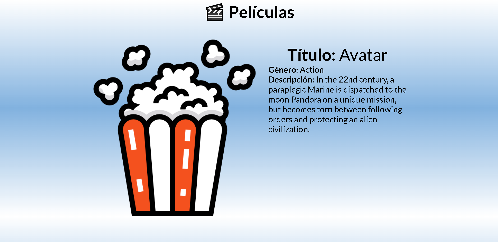
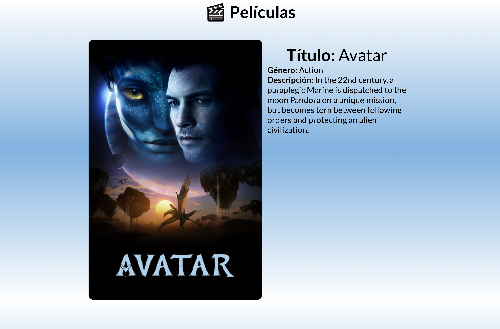

# React - Fundamentos

## Tecnologías Utilizadas:

- React (Routes, useState, useEffect, useParams)
- Git 
- Api - themoviedb.org

---
## Descripción 📘 

Proyecto para revisar los fundamentos de React, uso de Hooks, uso de Routes, orden de pages y components.
Además de utilizar la Api de themoviedb.org, para mostrar las películas deseadas.

---
## Vista Principal 🎬
---

---
## Vista Detalle 📽 
---

